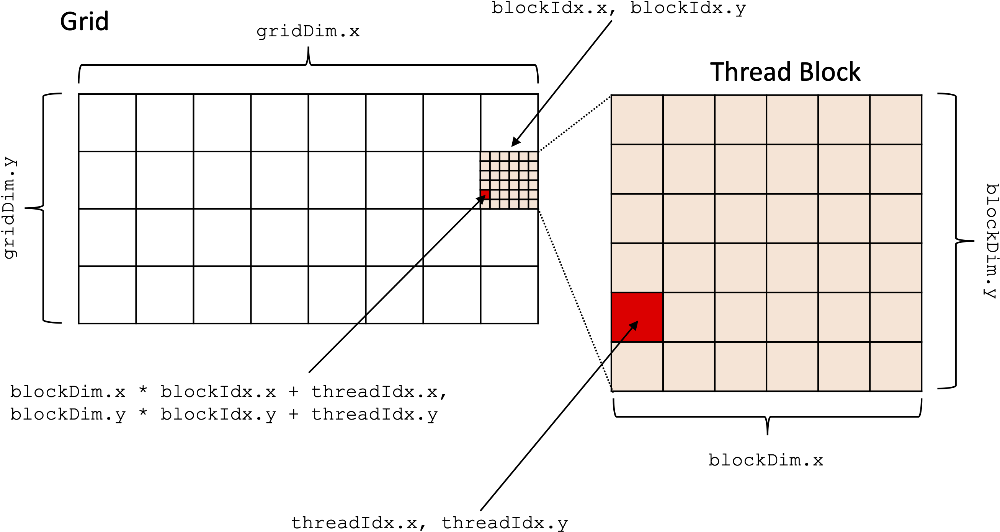

# Talk/Demos: GPUs and Kernel Fusion

Note: this is a work in progress

## Overview

This repo is written to accompany a talk on GPUs and kernel fusion.
It contains 7 demos that taken together (ideally) illustrate the following:
* Basics of CUDA kernels
* Why kernel fusion is desirable yet non-trivial
* How to somewhat-easily do it using Triton

## Building/Running

* To build the CUDA examples, use SCons. This means insatalling Scons if you don't already have it, then just running `scons` inside this directory.
* You need to have a somewhat modern Nvidia GPU with all the CUDA drivers installed.
* The Python examples require PyTorch and Triton. Both can be installed with `pip` or equivalent stuff.
* Running the CUDA examples is as simple as `./1_matmul_basic <N>`. For simplicity, `N` must be a multiple of 32. I think 2048, 4096, 8192, and 16384
are nice numbers to try.

## Demos

### `1_matmul_basic.cu`

This file demonstrates the basics of CUDA programming. The goal is to multiply two
`N x N` matrices, `A` and `B`.

While the GPU ("device") is connected to the CPU ("host"), the two do not share memory.
Therefore, while we are able to construct `A_host` and `B_host` in normal C++ on the
CPU, they *are not* present in GPU memory until they are explicitly copied over.

So, after constructing `A_host` and `B_host`, we first allocate memory for them
(and their product, `C`) on the device using `cudaMalloc`.
Once `A_device`, `B_device`, and `C_device` have been allocated on the GPU,
we use `cudaMemcpy` to transfer over the actual values of `A` and `B`.
Note that this `cudaMemcpy` is very slow compared to most other GPU operations.

All computation on the GPU happens in *kernels*. We can think of kernels
as "functions that execute on the GPU." In turn, kernels are composed of
a grid of `blocks`. Each
block is in turn made up of multiple `threads`.
CUDA programmers must specify grid and thread block dimensions when ``launching" (invoking)
a kernel. We can see a rough illustration of this grid and block stuff here:



*All* of a kernel's thread execute the same code. This is not as limiting as it may seem!
Each thread also has access to its own specific values of 
`blockIdx.x`, `blockIdx.y`, `threadIdx.x`, `threadIdx.y`.
So in theory, it'd be possible to do:
```
if (threadIdx.x == 0 && threadIdx.y == 0 && blockIdx.x == 0 && blockIdx.y == 0) {
    // some code
} else if (threadIdx.x == 1 && threadIdx.y == 0 && blockIdx.x == 0 && blockIdx.y == 0) {
    // some other code
} else if (...) {
    ...
}
```
In practice, this would be *extremely* inefficient. In most kernels that I am aware of,
threads tend to do relatively similar things.

In `1_matmul_basic.cu`, I have *decided* (this is not forced by CUDA, 
this is a programmer decision!) to make each thread responsible for calculating
a single output entry of `C`. So, each thread `x, y` is responsible for computing
`C[y,x] = dot(A[y,:], B[:,x])`.
With this in mind, we can start to divide up our grid. We want a single thread
per each entry of `C`, so we want an `N x N` overall grid of threads.

One question might be: why not just put them all in the same block?
The hardware limits the size of a single threadblock to `1024` threads.
So, I opted to make each block `32 x 32`, and then make a grid of `(N / 32) x (N / 32)`
blocks.

Note the code defining all of this:

```
dim3 block_dim(BLOCK_DIM, BLOCK_DIM);
dim3 grid_dim(N / BLOCK_DIM, N / BLOCK_DIM);
```

The actual kernel launch happens here:

```
matrix_multiply<<<grid_dim, block_dim>>>(A_device, B_device, C_device, N);
```

With the `grid_dim` and `block_dim` as "CUDA parameters". They sort of look like
template parameters, but they're not.

OK, now let's go look at what actually happens inside this kernel:

```
__global__ void matrix_multiply(float* A, float* B, float* C, size_t N) {

    // Calculate row and column of C to work on
    uint32_t row = blockIdx.y * blockDim.y + threadIdx.y;
    uint32_t col = blockIdx.x * blockDim.x + threadIdx.x;

    // Calculate C[row][col]
    float accum = 0.0f;
    for (uint32_t i = 0; i < N; i++) {
        accum += A[row * N + i] * B[i * N + col];
    }
    C[row * N + col] = accum;
}
```

The first thing that happens inside the kernel is that the thread needs to figure out
who it is. Remember: all threads are running the same code-- so, using the magic 
`blockIdx` and `threadIdx` structs is the only way that threads can figure out
where they exist within the grid.

Once a thread has figured out its row and column within the `C` matrix,
it simply executes a dot product in a quite straightforward `C/C++` way.
Basically, most of the code inside of a kernel is super standard `C/C++`,
except that you need to keep in mind that it is being executed concurrently 
with tons of other threads in the same kernel!

NOTE: thread blocks and grids can actually be 3 dimensional, but that's a trivial extension
to everything written above. Also, note that in general, dimensions are a "programmer 
convenience"
feature. It'd be perfectly possible to just have `threadIdx.x` and do the following:

```
int threadIdx_x = threadIdx.x % blockDim.x
int threadIdx_y = threadIdx.x / blockDim.x
```

### `2_matmul_sharedmem.cu`

Loading values from GPU main memory is expensive. In the kernel from `1_matmul_basic`,
every multiply-accumulate looks like: `accum += A[row * N + i] * B[i * N + col]`--
`A` and `B` are pointers to data that lives in the GPU's main memory.
So, each multiply requires loading 2 values from memory! That's super expensive
and will bottleneck our kernel.

To speed things up, the GPU exposes a faster, software-managed scratchpad memory.
It is called ``shared memory" because it is shared within  block.
This is somewhat confusing because shared memory is *less shared* than GPU main memory
which is shared across *all blocks*, but whatever.

Accesses to shared memory are *vastly* cheaper than accesses to GPU main memory.
However, they must be explicitly programmer.

In this example, we first declare two buffers in shared memory as follows:

```
__shared__ float A_shared[BLOCK_DIM][BLOCK_DIM];
__shared__ float B_shared[BLOCK_DIM][BLOCK_DIM];
```

Each block will have its own copy of these buffers. Hardware only supports
a fixed amount of shared memory per block, and this varies by GPU.
However, because shared memory must be allocated statically,
your compiler will just fail if you try to allocate too much.
This memory only exists for the lifetime of a particular thread block.

In this example, we load *tiles* of `A` and `B` into shared memory as follows:

```
    for (uint32_t t = 0; t < N; t += BLOCK_DIM) {
            
        A_shared[threadIdx.y][threadIdx.x] = A[row * N + t + threadIdx.x];
        B_shared[threadIdx.y][threadIdx.x] = B[(t + threadIdx.y) * N + col];
        ...
    }
```

At each tiled loop iteration, each thread is responsible for bringing a single
value into GPU shared memory.
After loading in a value, threads within a block must take a barrier: 

```
__syncthreads();
```

This is beacuse threads within an entire block do not necessarily run in lockstep.
In order to continue to the next part of the algorithm (multiplying the `A` tile
with the `B` tile), we must *know* that the *entire* `A` and `B` tiles have been
loaded.

After the intra-block `__syncthreads()` barrier, we can just go ahead and
multiply the tiles:

```
for (uint32_t k = 0; k < BLOCK_DIM; k++) {
    accum += A_shared[threadIdx.y][k] * B_shared[k][threadIdx.x];
}
```

Note that all indices here are indices *into the shared memory*. They have
*nothing* to do with the actual coordinates of the values within `A` and `B`.


### `3_matmul_tensorcore.cu`

This is a counterexample-- for certain precisions (fp16, int8, on newer GPUs even fp64),
there are *tensor cores* that provide high throughput matrix multiplications.
Tensor cores are invoked using:

```
nvcuda::wmma::mma_sync(c_frag, a_frag, b_frag, c_frag);
```

However, they are really hard to use! This is my attempt at using them, and it doesn't go super well.
I will dedicate more time to this, but the point is that writing peak performance dense matrix
multiplications is not totally trivial.


### `4_matmul_cublas.cu`

Calling libraries is much easier! cuBLAS achieves basically peak throughput with very little code.

### `5_gating_pytorch.py`

OK, so far we've seen a decent amount of CUDA. We've (hopefully) learned the following:
* It is posible to write your own CUDA kernels and get good but not optimal performance (without a ton of tuning)
* Or, you can call Nvidia provided libraries and get near-optimal performance out of the box

A reasonable question is: "what's the point of writing your own kernels if the Nvidia provided ones are so good?"
Is it only for things that are actually un-supported by the libraries?
To answer these questions, let's look at `5_gating_pytorch.py`.

Here, we are computing the following function:

```
def forward(x, W1, W2, b1, b2):
    result = (x @ W1) + b1
    result.sigmoid_()
    result *= (x @ W2) + b2
    return result
```

PyTorch will dispatch all of the functions in here to carefully optimized Nvidia libraries.
However, the overall performance is not great! On my V100, this gets just 11 TFLOP/s (fp16) 
out of a possible 112 TFLOP/s (fp16). What gives?

The problem is that this single function calls *multiple kernels*. I haven't looked at exactly what
kernels are launched, but it may be something like this:
```
t0 = gemm(x, W1)
t1 = add(t0, b1)
t2 = sigmoid(t1)
t3 = gemm(x, W2)
t4 = add(t3, b2)
t5 = mul(t2, t4)
```

This is not great! Even if there were no overheads to launching kernels, this implementation
causes a ton of *excess data movement*. Think back to `2_matmul_sharedmem.cu`: 
in that kernel, we go through the trouble of loading various tiles of the matrix from main memory into shared memory,
multiplying them, then at the end, storing our final result back to main memory.
Why don't we just add the `b1` and apply the sigmoid to our output tile *before* storing it back to shared memory?
Why don't we just load `x` *once* and multiply it by both `W1` *and* `W2`?

The problem is the kernel abstraction: Nvidia provides libraries that "do a thing", but they provide them as a
full kernel that you call into. If you call `cublasGemmEx`, you *cannot* say "oh while you're doing that, also apply a sigmoid,"
because it's just operating at *a different level of abstraction*.

What we really want to do here is called *kernel fusion*. By designing a kernel to do the entire `forward()`, function,
we are able to reduce the number of kernel launches, and more importantly, *the total data movement*. 
And that's just what we'll do in the next example.

### `6_gating_fused.py`

The most immediate problem we have with fusing together the kernels in `forward()` is that writing
highly performant tensor core code in CUDA is hard.
If we go with my ~8 TFLOP/s (fp16) implementation from `3_matmul_tensorcore.cu`, even if we fuse
everything here into a single kernel, we will *still* underperform the aggregate 11 TFLOP/s
that PyTorch gets.

Fortunately we can use Triton to write our kernels instead. Triton is a library that lets
us write kernels in Python. It is pretty flexible, but mostly useful when you're writing things
that need to feed the tensor cores. As we saw in `3_matmul_tensorcore.cu`, efficiently
utilizing them is difficult. Triton makes this part easy (it's just `tl.dot`), 
and only forces the user to think about data movement instead.

Looking at `fused_kernel()` in `6_gating_fused.py`, we first allocate
two accumulator tiles `accum_w1` and `accum_w2`, then sweep across the
matrix co-iteration dimension accumulating partial products into these
accumulators.
By the end of the loop, `accum_w1` represents a complete tile of the output matrix `x @ W1`
and `accum_w2` represents a complete tile of `x @ W2`.
The real magic comes in *after* the loop-- without ever writing back these tiles to main
memory, we are able to add in the biases, apply the sigmoid, and elementwise
multiply the results together.
This greatly reduces data movement and results in a large speedup overall.

`bonus_benchmark_fused.py` does the benchmarking more carefully, but this optimization achieves
a ~2-3x speedup on my V100 while also providing substantial GPU memory savings.

Importantly, this example shows that it is important to "pick your spots."
It is impractical (and maybe impossible?) to achieve a speedup over
cuBLAS's `cublasGemmEx` in general-- however, by taking a step back
and looking at the application overall, we recognize some *large* inefficiencies.
Once we've seen these large inefficiencies, we can use the proper tools (Triton)
to *quickly* engineer a solution that is not "speed of light" fast, 
but still handily beats the baseline.

### `bonus_matmul_A_stationary.cu`

For the matrix multiplication dataflow enthusiasts in the crowd,
this is just a quick demo of what a simple `A`-stationary matrix multiplication
might look like.
Because many separate blocks are contributing to the same element of the output matrix,
we need to accumulate their updates with `atomicAdd`. This is predictably quite slow
and inefficient, but necessary in this setting.
More performant `A`-stationary implementations exist, but *in general* this dataflow
is not very GPU friendly.

### `bonus_benchmark_fused.py`

More rigurous benchmarking code for `6_gating_fused.py`.